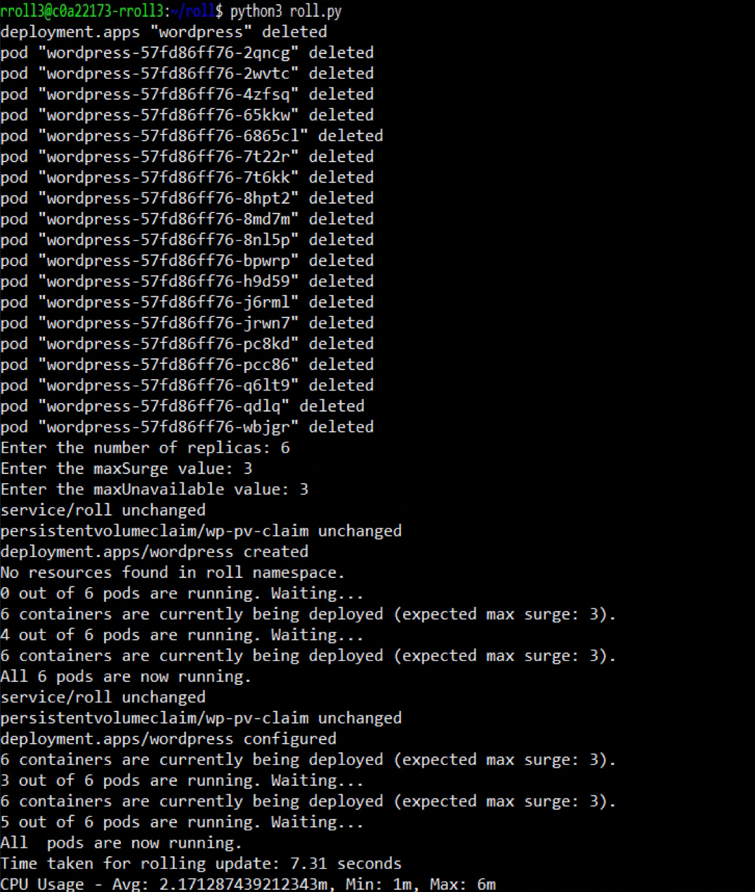

# roll-update

This repository contains the files used to perform a rolling update on the WordPress application.

### Contents
- **YAML Files**: These files are essential for the update process.
- **Python Files**: Scripts to handle the update from one version to another.
  - Rolling update from version 6.2.1 to 6.3.1.
  - Rolling update from version 6.1.1 to 6.3.1.

### How to Set Up Environment for Rolling Update
First, within a VM equipped with k3s, copy and paste the three YAML files into a directory. The contents of the directory should be as follows:
- `kustomization.yaml`
- `mysql-deployment.yaml`
- `wordpress-deployment.yaml`

After saving the three files, use the command below to apply the files:

```
kubectl apply .k -n roll
```
This command deploys the pods in a namespace called "roll." If you wish to deploy the pods in the default namespace, remove `-n roll` from the command. This adjustment should also be applied to any future commands.

After deploying the pods, you can check the status of the pods with the following command:

```
kubectl get pod -n roll
```
The expected outcome should be like this.
```
NAME                               READY   STATUS    RESTARTS      AGE
wordpress-c8d76b68-64kpf           1/1     Running   1 (10m ago)   12m
wordpress-c8d76b68-n98sc           1/1     Running   0             12m
wordpress-c8d76b68-v25v4           1/1     Running   0             12m
wordpress-mysql-5c5bf57bdb-bf8ww   1/1     Running   0             12m
```

Once all of the pods are in the "Running" state, we can proceed to the rolling update.

### How to use execute rolling updates

First of all, there are two python codes included inside this repository:<br />
  -Rolling update from 6.2.1 version to 6.3.1 version<br />
  -Rolling update from 6.1.1 version to 6.3.1 version<br />

The contents of the code is generally the same, the only thing different is the version of the wordpress application written in the wordpress-deployment.yaml file. below is an example of the version written in the file.

```
        spec:
      containers:
      - name: wordpress
        image: wordpress:6.2.1-apache
        imagePullPolicy: Always
        env:
```
In the "name"part inside of the "spec" part of the deployment, the above is written. currently, the version is 6.2.1 but we will be updating the wordpress application to 6.3.1 by using the rollupdate_621_631.py code.<br />

The contents of the code is quite complicated to explain in detail, but i will be explaining the flow of the code below:

#### 1. Deleting existing pods and deployments <br />
Since the rolling update code will be used alot of times for data etc, the code will firstly delete all of the existing pods and deployments so that the version of the wordpress image could be set. the following commands will be used to delete it;

```
kubectl delete deployment wordpress -n roll
kubectl delete deployment wordpress-mysql -n roll
kubectl delete pods --all -n roll
```

#### 2. Replicas, maxSurge and maxUnavaliable inquiry <br />
After deleting the existing pods and deployments, the code will then request the user to input the desired value for the 3 values stated. in the main function of the rolling update code, the following part of the code is the syntax for the stated function;
```
    replicas = int(input("Enter the number of replicas: "))
    max_surge = int(input("Enter the maxSurge value: "))
    max_unavailable = int(input("Enter the maxUnavailable value: "))
```

#### 3. First deployment of wordpress application <br />
After determining the three values stated above, the code will deploy the wordpress deployment file with it's image version being 6.2.1 using the following command;
```
kubectl apply -f wordpress-deployment.yaml -n roll
```

#### 4. rolling update <br />
After the wordpress application with image version 6.2.1 is deployed, the code will then rewrite the image version to 6.3.1 so that the rolling update will be executed. the following code inside the main function is what edits the wordpress deployment file:
```
    edit_yaml_file("6.3.1", replicas, max_surge, max_unavailable)
```

#### 5. Output example <br />
After the rolling update is finished, the code will then record the time taken for the rolling update and alsothe average CPU usage during the rolling update. <br />
Below is an example of what will be shown on the terminal after the whole python code is finished executing.<br />
Use the following command to run the python script. <br />
```
python3 rollupdate_621_631.py
```
The following output will come out when replicas is set to 6, maxsurge and maxunavailable is set to 3.
```
rroll3@c0a022173-rroll3:~/roll$ python3 roll.py
deployment.apps "wordpress" deleted
pod "wordpress-57fd86ff76-2qncg" deleted
pod "wordpress-57fd86ff76-2wvtc" deleted
pod "wordpress-57fd86ff76-4zfsq" deleted
pod "wordpress-57fd86ff76-65kmw" deleted
pod "wordpress-57fd86ff76-686sc1" deleted
pod "wordpress-57fd86ff76-7t22r" deleted
pod "wordpress-57fd86ff76-7t6kk" deleted
pod "wordpress-57fd86ff76-8hpt2" deleted
pod "wordpress-57fd86ff76-3nd7m" deleted
pod "wordpress-57fd86ff76-8n15p" deleted
pod "wordpress-57fd86ff76-bpwrp" deleted
pod "wordpress-57fd86ff76-hd95q" deleted
pod "wordpress-57fd86ff76-j6rm1" deleted
pod "wordpress-57fd86ff76-jwrn7" deleted
pod "wordpress-57fd86ff76-p8ckd" deleted
pod "wordpress-57fd86ff76-pcc86" deleted
pod "wordpress-57fd86ff76-dl1tq" deleted
pod "wordpress-57fd86ff76-dqlq" deleted
pod "wordpress-57fd86ff76-wbjgr" deleted
Enter the number of replicas: 6
Enter the maxSurge value: 3
Enter the maxUnavailable value: 3
service/roll unchanged
persistentvolumeclaim/wp-pv-claim unchanged
deployment.apps/wordpress created
No resources found in roll namespace.
0 out of 6 pods are running. Waiting...
0 containers are currently being deployed (expected max surge: 3).
4 out of 6 pods are running. Waiting...
6 containers are currently being deployed (expected max surge: 3).
All 6 pods are now running.
Service/roll unchanged
persistentvolumeclaim/wp-pv-claim unchanged
deployment.apps/wordpress configured
6 containers are currently being deployed
3 out of 6 pods are running. Waiting...
6 containers are currently being deployed (expected max surge: 3).
0 out of 6 pods are running. Waiting...
All pods are now running.
Time taken for rolling update: 7.31 seconds
CPU Usage Avg: 2.17287439212343m, Min: 1m, Max: 6m
```


As you can see on the code above, the code will execute a rolling update while also recording the time taken for the rolling update and the CPU usage. <br />
